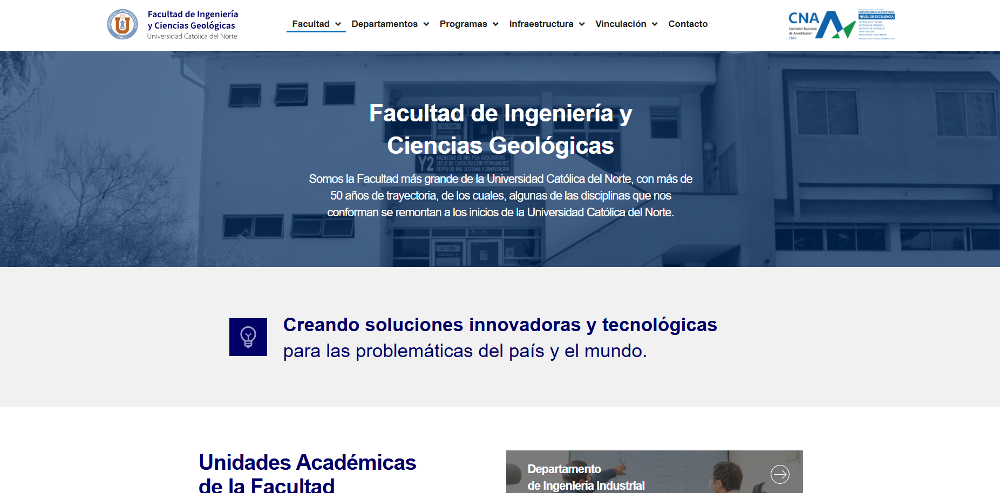
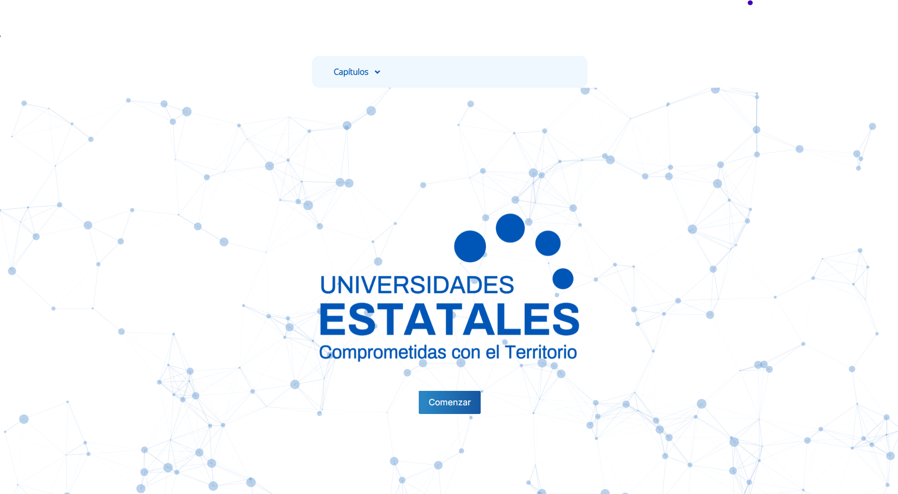
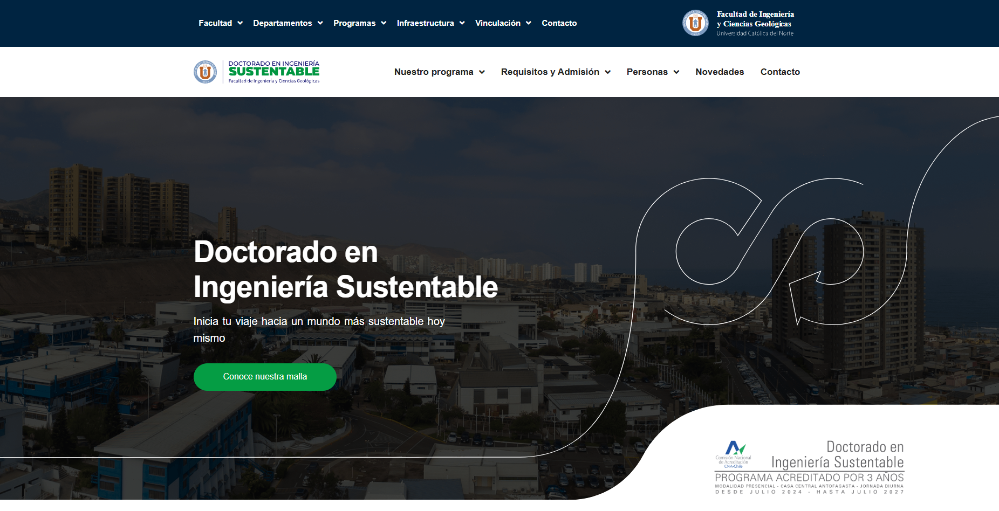
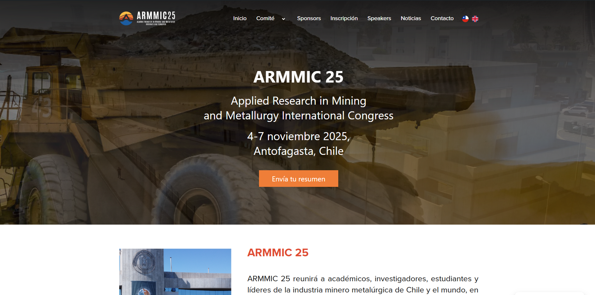
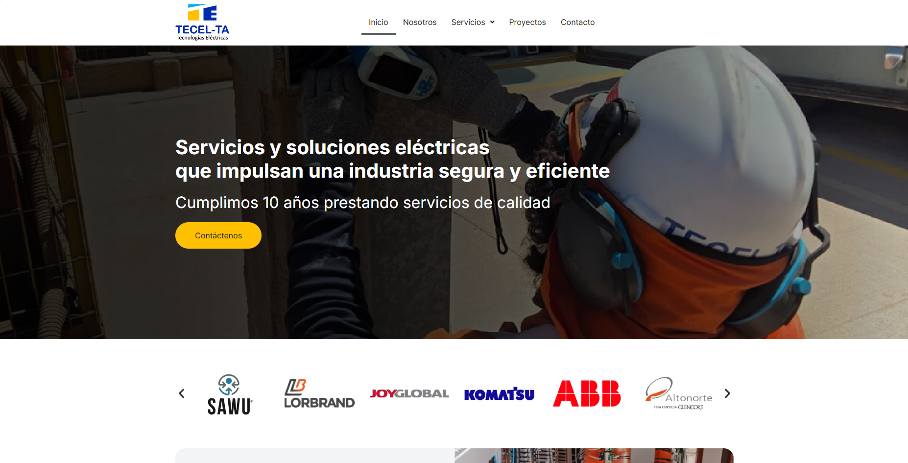

  <h1>Omar Hurtado Gajardo</h1>
  
<b>Desarrollador Web | UI/UX | Optimización SEO</b>

  
   

  

    
    
  

 

## 👨‍💻 Sobre mí

Hola, soy **Omar Hurtado**, desarrollador web. Me especializo en la creación de plataformas digitales escalables, funcionales y orientadas a la experiencia de usuario. 

Mi formación como Técnico en Telecomunicaciones e **Ingeniería en Informática** me permite abordar los proyectos desde el diseño visual hasta la optimización técnica para SEO y rendimiento (WPO).

 

  
  
  
  
  
  

 

## 📌 Sitios Web Realizados

<h3>🌐 <a href="https://ficg.ucn.cl">Universidad Católica Del Norte - UCN</a></h3>

  
  
  
  

  <strong>🧾 Descripción:</strong> Proyecto realizado para la Facultad de Ingeniería y Ciencias Geológicas de la UCN. El desarrollo se centró en optimizar la arquitectura de la información para presentar de forma clara su amplia oferta académica, investigaciones y su vinculación estratégica con la industria de la zona norte.

<h3>🌐 <a href="#">Consorcio de Universidades del Estado (CUECH)</a></h3>

  
  
  

  <strong>🧾 Descripción:</strong> Proyecto realizado para el Consorcio de Universidades del Estado de Chile (CUECH). Consistió en el diseño y desarrollo de un Memorial Digital conmemorativo, priorizando una interfaz sobria, respetuosa y completamente responsiva.

<h3>🌐 <a href="https://ficg.ucn.cl/doctorado-en-ingenieria-sustentable/">Doctorado en Ingeniería Sustentable</a></h3>

  
  
  

  <strong>🧾 Descripción:</strong> Proyecto realizado para el programa de Doctorado en Ingeniería Sustentable de la UCN. Se creó una landing page atractiva y optimizada para la captación de postulantes, destacando su enfoque académico interdisciplinario y compromiso medioambiental.

<h3>🌐 <a href="https://armmic.cl">Congreso Internacional ARMMIC</a></h3>

  
  
  

  <strong>🧾 Descripción:</strong> Proyecto realizado para el Applied Research in Mining and Metallurgy International Congress (ARMMIC). Plataforma oficial desarrollada para gestionar la información del evento, perfiles de ponentes internacionales y el proceso completo de inscripción.

<h3>🌐 <a href="https://tecel-ta.cl">TECEL-TA</a></h3>

  
  
  

  <strong>🧾 Descripción:</strong> Proyecto realizado para TECEL-TA, empresa chilena especializada en servicios de ingeniería y mantenimiento eléctrico para la gran minería. El sitio destaca su trayectoria corporativa, servicios especializados y acreditaciones clave para el sector industrial.

<h3>🌐 <a href="https://brimut.cl">Brimut</a></h3>

  
  
  

  <strong>🧾 Descripción:</strong> Proyecto realizado para BRIMUT SpA, empresa enfocada en el transporte de pasajeros y arriendo de vehículos. Se priorizó un diseño orientado a la conversión comercial, con una navegación rápida e intuitiva para clientes corporativos.

<h3>🌐 <a href="https://ikono.cl">IKONO</a></h3>

  
  
  

  <strong>🧾 Descripción:</strong> Proyecto realizado para IKONO, consolidada oficina de arquitectura. Se desarrolló un portafolio digital inmersivo y minimalista diseñado específicamente para dar un gran protagonismo visual a sus proyectos habitacionales e industriales.

<h3>🌐 <a href="https://adisep.cl">Adisep</a></h3>

  
  
  

  <strong>🧾 Descripción:</strong> Proyecto realizado para ADISEP, empresa especializada en seguridad privada. Se estructuró una web corporativa seria y confiable que detalla sus servicios de vigilancia y capacitación OS10, optimizando los formularios de contacto.

<h3>🌐 <a href="https://lacavernachile.cl">La Caverna</a></h3>

  
  
  
  

  <strong>🧾 Descripción:</strong> Proyecto realizado para La Caverna. Desarrollo integral de una tienda online (E-commerce) orientada al retail minorista, incorporando un carrito de compras ágil, gestión dinámica de inventario y un diseño visual enfocado en maximizar ventas.

<h3>🌐 <a href="https://trcmaquinas.cl">TRC Máquinas</a></h3>

  
  
  

  <strong>🧾 Descripción:</strong> Proyecto realizado para TRC Máquinas, maestranza ubicada en Antofagasta. El sitio expone su capacidad técnica corporativa en reparaciones mecánicas, oleohidráulica y fabricación de estructuras metálicas para la industria local.

<h3>🌐 <a href="https://valintec40.com">Valintec 4.0</a></h3>

  
  
  
  

  <strong>🧾 Descripción:</strong> Proyecto realizado para Valintec 4.0, especialistas en soluciones industriales avanzadas. La plataforma funciona como un extenso catálogo técnico de válvulas e instrumentación dirigido a ingenieros del sector minero, energía y aguas.

<h3>🌐 <a href="https://pestañamania.cl">Pestañamania</a></h3>

  
  
  
  

  <strong>🧾 Descripción:</strong> Proyecto realizado para Pestañamania, tienda online B2C del sector belleza. Se implementó un E-commerce completo para la venta de insumos y extensiones de pestañas, con gestión de inventario, pagos en línea y un estilo visual muy cuidado.

<h3>🌐 <a href="https://transportesylogistica.cl">Transportes y Logística</a></h3>

  
  
  

  <strong>🧾 Descripción:</strong> Proyecto realizado para Transportes y Logística, empresa de carga terrestre nacional. El diseño institucional se enfocó en facilitar el contacto comercial rápido y detallar la flota disponible para servicios de transporte B2B.

<h3>🌐 <a href="https://tornerialidmar.cl">Tornería Lidmar</a></h3>

  
  
  

  <strong>🧾 Descripción:</strong> Proyecto realizado para Tornería Lidmar. Se construyó una plataforma digital que resalta su capacidad operativa y experiencia en mecanizado de precisión, tornería y fabricación a medida de piezas industriales.

<h3>🌐 <a href="https://rpichile.cl">RPI Chile</a></h3>

  
  
  

  <strong>🧾 Descripción:</strong> Proyecto realizado para RPI Chile. Se desarrolló un catálogo web interactivo para potenciar la comercialización y el arriendo de equipos industriales especializados en soldaduras plásticas y termofusión de tuberías HDPE.

<h3>🌐 <a href="https://cardiopreparado.cl">Cardiopreparado</a></h3>

  
  
  
  

  <strong>🧾 Descripción:</strong> Proyecto realizado para Cardiopreparado, empresa orientada a la salud y prevención de emergencias. El sitio facilita la venta de desfibriladores (DEA) y la inscripción a capacitaciones corporativas de primeros auxilios.

<h3>🌐 <a href="https://blondina.cl">Blondina</a></h3>

  
  
  
  

  <strong>🧾 Descripción:</strong> Proyecto realizado para Blondina, marca chilena de moda femenina. E-commerce desarrollado con una estética visual vanguardista, destacando colecciones de ropa, integrando pasarelas de pago y optimizando la experiencia móvil.

<h3>🌐 <a href="https://containerland.cl">Containerland</a></h3>

  
  
  
  

  <strong>🧾 Descripción:</strong> Proyecto realizado para Containerland, fabricantes chilenos de contenedores modulares. El sitio muestra su catálogo de módulos habitacionales de acero galvanizado para oficinas y bodegas, facilitando la cotización directa.

<h3>🌐 <a href="https://fitstore.cl">FITSTORE</a></h3>

  
  
  
  

  <strong>🧾 Descripción:</strong> Proyecto realizado para FITSTORE, tienda online dedicada a la suplementación y nutrición deportiva. Se optimizó la arquitectura por categorías de entrenamiento y se simplificó el proceso de checkout para mejorar la conversión.

<h3>🌐 <a href="https://limpialimpio.cl">LimpiaLimpio</a></h3>

  
  
  
  

  <strong>🧾 Descripción:</strong> Proyecto realizado para Limpia Limpio, proveedores de insumos de aseo industrial y hogar. Se estructuró un catálogo digital ordenado que facilita la navegación por líneas de productos y la solicitud de presupuestos B2B.

<h3>🌐 <a href="https://www.hippocampus.cl">Hippocampus Resort</a></h3>

  
  
  

  <strong>🧾 Descripción:</strong> Proyecto realizado para Hippocampus Resort, prestigioso complejo turístico en Concón. Web corporativa diseñada para proyectar la calidad de sus instalaciones, promover servicios hoteleros y captar reservas directas.

<h3>🌐 <a href="https://maxilosantiago.cl">Maxilofacial Santiago</a></h3>

  
  
  

  <strong>🧾 Descripción:</strong> Proyecto realizado para Maxilofacial Santiago, clínica odontológica especializada. La plataforma comunica de manera clara sus tratamientos quirúrgicos y cuenta con herramientas de accesibilidad para la reserva de horas online.

<h3>🌐 <a href="https://megacorpltda.cl">Megacorp Ltda</a></h3>

  
  
  

  <strong>🧾 Descripción:</strong> Proyecto realizado para Megacorp Ltda, importadora y comercializadora de suministros industriales. El sitio se organizó como un catálogo técnico riguroso, enfocado principalmente en correas de transmisión de alta resistencia.

<h3>🌐 <a href="https://conjuntochile.cl">Conjunto</a></h3>

  
  
  

  <strong>🧾 Descripción:</strong> Proyecto realizado para Conjunto Chile, destacada consultora estratégica. Se diseñó un sitio corporativo que refleja su enfoque analítico en el desarrollo sostenible, relacionamiento comunitario y viabilidad de proyectos industriales.

<h3>🌐 <a href="https://comercialocaranza.cl">Comercial Ocaranza</a></h3>

  
  
  
  

  <strong>🧾 Descripción:</strong> Proyecto realizado para Comercial Ocaranza, empresa familiar de Coquimbo. El desarrollo visibiliza digitalmente su sólida trayectoria de 40 años comercializando equipos marítimos, insumos de buceo y maquinaria pesada.

<h3>🌐 <a href="https://comercialandaurybenacho.cl">Andaur & Benacho</a></h3>

  
  
  
  

  <strong>🧾 Descripción:</strong> Proyecto realizado para Andaur & Benacho Agro Comercial. Se logró integrar de forma cohesionada en una sola plataforma sus dos principales líneas operativas en Calama: el comercio de productos agrícolas y la logística de transporte de carga.

## 🤝 ¿Hablamos?

- **Desarrollo:** Sitios web escalables y plataformas a medida.
- **Rediseños:** Mejoras de rendimiento (WPO) y modernización UI.
- **Asesoría:** Experto en WordPress, Elementor y SEO.

📧 [hgdevr@gmail.com](mailto:hgdevr@gmail.com) | 💼 [LinkedIn](https://www.linkedin.com/in/hgdevs/)

  Hecho con 💙 en Chile | 2026

