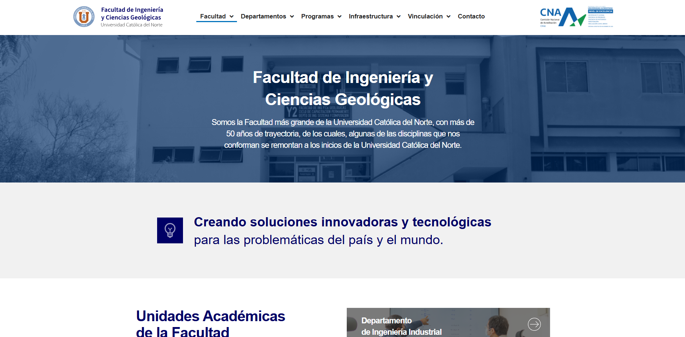
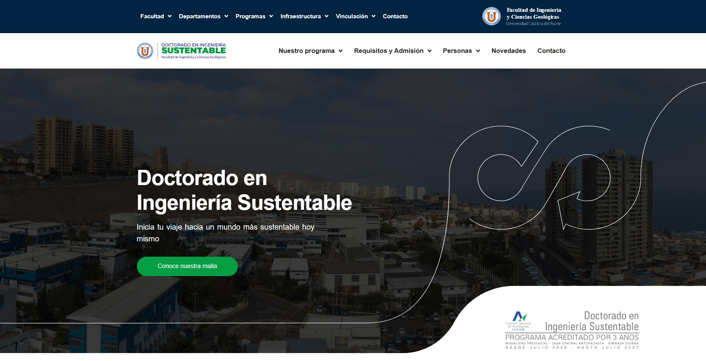

<h1 align="center">🌐 Portafolio - Omar Hurtado Gajardo 🌐</h1>

  
  
  
  

## 📌 Sobre mí

Hola, soy **Omar Hurtado**, desarrollador web con enfoque en experiencia de usuario, diseño visual y optimización SEO. Este portafolio presenta proyectos reales en los que he trabajado, reflejando mi estilo, técnica y compromiso con cada cliente.

Inicié mis estudios cursando la carrera de Técnico en Telecomunicaciones en 2018. Posteriormente, desde 2019 a 2022 estudié Ingeniería en Informática en el Instituto Profesional DUOC UC.

> ✨ *“Diseñar un sitio web no solo es crear una página bonita, es construir una experiencia que conecte con las personas.”*
 
<h2 align="left">📌 Sitios Web Realizados</h2>

### 🌐 Universidad Católica Del Norte - UCN

**🌍 Sitio web:** [ficg.ucn.cl](https://ficg.ucn.cl)  
**🧾 Descripción:**  
Proyecto para la Facultad de Ingeniería y Ciencias Geológicas de la Universidad Católica del Norte. El objetivo fue mostrar de forma clara y accesible su oferta académica, proyectos de investigación y vínculo con la industria, destacando su rol como referente en ingeniería y geociencias en el norte de Chile.

 

  
  
  
  

### 🌐 Doctorado en Ingeniería Sustentable

**🌍 Sitio web:** [ficg.ucn.cl/doctorado-en-ingenieria-sustentable](https://ficg.ucn.cl/doctorado-en-ingenieria-sustentable/)  
**🧾 Descripción:**  
Proyecto para el Doctorado en Ingeniería Sustentable de la Universidad Católica del Norte, enfocándome en comunicar de forma clara y atractiva los objetivos del programa, su enfoque interdisciplinario y su compromiso con la sostenibilidad. 

 

  
  
  
  

### 🌐 Applied Research in Mining and Metallurgy International Congress - ARMMIC

**🌍 Sitio web:** [armmic.cl](https://armmic.cl)  
**🧾 Descripción:**  
Proyecto para el Congreso Internacional de Investigación Aplicada en Minería y Metalurgia (ARMMIC 25), organizado por la Universidad Católica del Norte. El sitio presenta de manera clara y accesible la información del evento, incluyendo fechas, programa, ponentes y proceso de inscripción, destacando su enfoque en sostenibilidad, innovación y colaboración entre academia e industria en el ámbito minero-metalúrgico.

 

  
  
  
  

### 🌐 Brimut

**🌍 Sitio web:** [brimut.cl](https://brimut.cl)  
**🧾 Descripción:**  
Proyecto para BRIMUT SpA, empresa de transporte y arriendo de vehículos. El desarrollo se centró en ofrecer un sitio funcional, rápido y fácil de navegar, orientado a clientes que buscan soluciones de transporte confiables.

 

  
  
  
  

### 🌐 IKONO

**🌍 Sitio web:** [ikono.cl](https://ikono.cl)  
**🧾 Descripción:**  
Proyecto para Ikono, una oficina de arquitectura fundada en 2006 que ofrece soluciones integrales en proyectos industriales, habitacionales y sociales.
 

  
  
  
  

### 🌐 Adisep

**🌍 Sitio web:** [adisep.cl](https://adisep.cl)  
**🧾 Descripción:**  
Proyecto para ADISEP, empresa chilena especializada en seguridad privada. El sitio presenta sus servicios de forma clara y profesional, incluyendo guardias de seguridad, vigilancia móvil, asesorías personalizadas y capacitación OS10. 

 

  
  
  
  

### 🌐 La Caverna

**🌍 Sitio web:** [lacavernachile.cl](https://lacavernachile.cl)  
**🧾 Descripción:**  
Lorem ipsum dolor sit amet, consectetur adipiscing elit, sed do eiusmod tempor incididunt ut labore et dolore magna aliqua. 

 

  
  
  
  
  

### 🌐 TRC Máquinas

**🌍 Sitio web:** [trcmaquinas.cl](https://trcmaquinas.cl)  
**🧾 Descripción:**  
Proyecto para TRC Máquinas, una maestranza emergente ubicada en Antofagasta, especializada en reparaciones mecánicas e hidráulicas, mecanizado de componentes y fabricación de estructuras metálicas.

 

  
  
  
  

### 🌐 Valintec40

**🌍 Sitio web:** [valintec40.com](valintec40.com)  
**🧾 Descripción:**  
Proyecto para Valintec 4.0, empresa chilena especializada en soluciones industriales avanzadas. La plataforma destaca su oferta de válvulas, actuadores, instrumentación y servicios de ingeniería para sectores como minería, celulosa, energía y tratamiento de aguas.

 

  
  
  
  
  

### 🌐 Pestañamania

**🌍 Sitio web:** [pestañamania.cl](https://pestañamania.cl)  
**🧾 Descripción:**  
Proyecto para Pestañamania, tienda online especializada en productos de belleza y cuidado personal, con énfasis en extensiones y tratamientos de pestañas.

 

  
  
  
  
  

### 🌐 Transportes y Logística

**🌍 Sitio web:** [transportesylogistica.cl](https://transportesylogistica.cl)  
**🧾 Descripción:**  
Proyecto para Transportes y Logística, empresa dedicada a servicios de transporte de carga y logística en Chile.
 

  
  
  
  

### 🌐 Tornería Lidmar

**🌍 Sitio web:** [https://tornerialidmar.cl](https://tornerialidmar.cl)  
**🧾 Descripción:**  
Proyecto para Tornería Lidmar, empresa especializada en mecanizado y fabricación de piezas industriales.

 

  
  
  
  

### 🌐 RPI

**🌍 Sitio web:** [rpichile.cl](https://rpichile.cl)  
**🧾 Descripción:**  
Proyecto para RPI Chile, empresa especializada en la venta y arriendo de equipos industriales para soldaduras plásticas, fitting de HDPE y herramientas para levantamiento de tubos lisos.
 

  
  
  
  
  

### 🌐 Cardiopreparado

**🌍 Sitio web:** [cardiopreparado.cl](https://cardiopreparado.cl)  
**🧾 Descripción:**  
Proyecto para Cardiopreparado, empresa chilena dedicada a la venta y capacitación en uso de desfibriladores automáticos (DEA) y equipos de emergencia.

 

  
  
  
  
  

### 🌐 Blondina

**🌍 Sitio web:** [blondina.cl](https://blondina.cl)  
**🧾 Descripción:**  
Proyecto para Blondina, tienda online de moda femenina que ofrece ropa y accesorios modernos.
 

  
  
  
  
  

### 🌐 Containerland

**🌍 Sitio web:** [containerland.cl](https://containerland.cl)  
**🧾 Descripción:**  
Proyecto para Containerland, empresa chilena especializada en la fabricación y venta de contenedores modulares de acero galvanizado.
 

  
  
  
  
  

### 🌐 FITSTORE

**🌍 Sitio web:** [fitstore.cl](https://fitstore.cl)  
**🧾 Descripción:**  
Proyecto para FitStore, Tienda especializada en suplementos deportivos, nutrición y accesorios para fitness, comprometida con apoyar un estilo de vida saludable y activo mediante productos de calidad.
 

  
  
  
  
  

### 🌐 LimpiaLimpio

**🌍 Sitio web:** [limpialimpio.cl](https://limpialimpio.cl)  
**🧾 Descripción:**  
Proyecto para Limpia Limpio, Empresa chilena dedicada a la venta de productos de limpieza y aseo, ofreciendo una amplia gama de soluciones para hogares, empresas e industrias que buscan calidad y eficiencia.
 

  
  
  
  

### 🌐 Hippocampus Resort

**🌍 Sitio web:** [hippocampus.cl](https://www.hippocampus.cl)  
**🧾 Descripción:**  
Proyecto para Hippocampus Resort, Hippocampus Resort es un exclusivo complejo turístico ubicado frente a una de las playas de Concón, en la región de Valparaíso.
 

  
  
  
  

### 🌐 Maxilofacial Santiago

**🌍 Sitio web:** [maxilosantiago.cl](https://maxilosantiago.cl)  
**🧾 Descripción:**  
Proyecto para Maxilofacial Santiago, clínica especializada en cirugía bucal y maxilofacial, ubicada en Providencia, Santiago.
 

  
  
  
  
  

### 🌐 Megacorp Ltda

**🌍 Sitio web:** [megacorpltda.cl](https://megacorpltda.cl)  
**🧾 Descripción:**  
Proyecto para Megacor Ltda, empresa chilena dedicada a la comercialización de productos industriales, con especialización en correas industriales.
 

  
  
  
  

### 🌐 Conjunto

**🌍 Sitio web:** [conjuntochile.cl](https://conjuntochile.cl)  
**🧾 Descripción:**  
Proyecto para Conjunto Chile. Una consultora estratégica chilena, especializada en ofrecer servicios integrales para el desarrollo sostenible de proyectos.
 

  
  
  
  

### 🌐 Comercial Ocaranza

**🌍 Sitio web:** [comercialocaranza.cl](https://comercialocaranza.cl)  
**🧾 Descripción:**  
Proyecto para Comercial Ocaranza. Portal de una empresa familiar con 40+ años en Coquimbo, Chile, especializada en equipos marítimos, buceo y maquinaria de fuerza.
 

  
  
  
  

## 🤝 ¿Hablamos?

Estoy disponible para:
- Desarrollo de sitios web a medida
- Rediseños y mejoras de sitios existentes
- Asesoría en WordPress y optimización

📧 **Email:** hgdevr@gmail.com 
💼 **LinkedIn:** [linkedin.com/in/hgdevs](https://www.linkedin.com/in/hgdevs/)

  Hecho con 💙 | Última actualización: Mayo 2025

